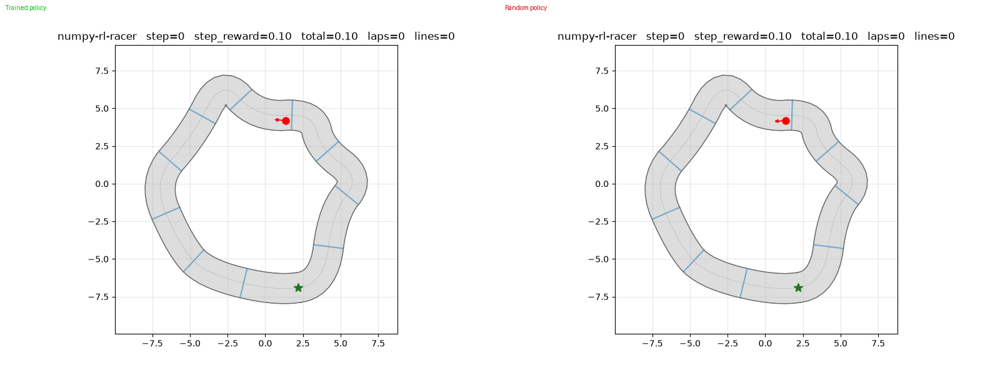

# NumPy RL Racer

A small from-scratch reinforcement learning racing project built with **NumPy only**.
No PyTorch, TensorFlow, JAX, Gymnasium, or external RL library.

The stable baseline is intentionally simple: a DQN agent learns to drive a small
2D car around a circular track using local, car-relative observations and a
progress-based reward. Extra experiments such as rectangular/figure-8 tracks,
obstacles, PER, Dueling DQN, NoisyNet, N-step returns, and GIF comparison tools
still exist in the repo, but they are not the default path.

## Features

**Stable v0 baseline:**
- Kinematic car with steering, acceleration, braking, and speed limits
- Circular track by default for stable first training
- Local observation vector: speed, heading error as sin/cos, distance to edge, and 5 ray distances
- Progress-based reward: forward progress, lap bonus, off-track penalty
- Plain DQN with replay buffer and target network
- No-idle action baseline: the default policy space only uses the three accelerating actions
- Matplotlib live viewer for watching a trained agent
- Training logs, checkpoints, and learning curves

**Experimental extensions:**
- Rectangular and figure-8 tracks
- Obstacles and collision penalties
- Legacy global-state observations
- Reward lines/checkpoint bonuses
- Double DQN, Dueling DQN, PER, NoisyNet, N-step returns
- Grid search and policy comparison GIF tooling

**Neural networks (NumPy only):**
- MLP and Dueling MLP
- Dense and NoisyLinear layers
- SGD with momentum and gradient clipping
- Adam with weight decay
- Learning-rate schedulers

## Environment Overview

The agent controls a **red car** (shown as a dot with a heading arrow) that drives on a 2D racetrack. The car uses a kinematic bicycle model — steering rotates its heading, and acceleration changes its speed. The goal is to **complete as many laps as possible** without driving off the road.

Three track types are available, each with a **start/finish line** (green star marker) where the car begins and lap completion is detected. Blue **reward lines** (checkpoint gates) are placed around the track — crossing one gives a bonus reward, encouraging the agent to complete the full loop:


**What the default v0 agent observes** (9-dimensional local vector):
| Observation | Description |
|---|---|
| `speed_norm` | Forward speed normalized by max speed |
| `sin_heading_error`, `cos_heading_error` | Car heading relative to the track tangent |
| `dist_to_edge` | Normalized distance to nearest road edge |
| `left_ray`, `front_left_ray`, `front_ray`, `front_right_ray`, `right_ray` | Local ray distances to track boundaries or obstacles |

**What the agent can do** (5 discrete actions):
| Action | Steering | Acceleration |
|---|---|---|
| Steer left + accelerate | -1.5 | +1.0 |
| Steer right + accelerate | +1.5 | +1.0 |
| Go straight + accelerate | 0.0 | +1.0 |
| Coast | 0.0 | 0.0 |
| Brake | 0.0 | -0.5 |

**Default v0 reward:**
- Positive reward for forward progress along the centerline
- Bonus for completing a lap
- Penalty for leaving the track
- Optional step, time, and collision penalties

## Quickstart

```bash
# Install dependencies
uv sync

# Run tests
uv run pytest

# Lint with ruff
uv run ruff check .
```

## Usage

```bash
# Train the v0 DQN baseline
uv run python scripts/train.py --episodes 500 --max-steps 300 --eval-freq 50 --eval-episodes 3 --save-dir models/v0 --log-dir logs/v0 --seed 0

# Watch a trained agent live
uv run python scripts/evaluate.py --model-path models/v0/best_model.npz --live --episodes 1 --max-steps 400 --fps 30

# Experimental: train with rectangular track, obstacles, and Dueling DQN
uv run python scripts/train.py \
  --track rectangular \
  --num-obstacles 5 \
  --dueling-dqn \
  --episodes 500

# Train with a JSON config file
uv run python scripts/train.py --config my_config.json

# Evaluate headlessly and save final frames
uv run python scripts/evaluate.py --model-path models/v0/best_model.npz --headless

# Grid search over hyperparameters
uv run python scripts/grid_search.py

# Demo the environment with a random policy
uv run python scripts/demo_render_env.py
```

## Training Results

The DQN agent was trained on the default circular v0 track. The training curve below shows the episode reward and average loss.


After training, the greedy policy was evaluated for 3 episodes. Below are the final frames of each evaluation rollout.

| Episode 1 | Episode 2 | Episode 3 |
|:---------:|:---------:|:---------:|
|  |  |  |

The side-by-side animation below contrasts the **trained DQN policy** (left) with a **random policy** (right) on the same track starting from the same position. The trained agent consistently stays on track and completes laps, while the random agent drives off the track within a few steps.



## Project constraints

Runtime dependencies:
- numpy
- matplotlib
- pillow (used by renderer for image saving)

Forbidden ML/RL dependencies:
- torch, tensorflow, jax, gymnasium, stable-baselines3

## Roadmap

### Stable

1. **Project skeleton** — Python package structure (`pyproject.toml`, `src/`, `tests/`).
2. **2D car physics** — `KinematicCar` / `CarState`.
3. **Circular racing baseline** — reset/step API, progress, laps, off-track termination.
4. **Local observations** — speed, heading error, distance-to-edge, and 5 ray distances.
5. **Progress reward** — simple forward-progress signal with lap and off-track terms.
6. **NumPy DQN baseline** — replay buffer, epsilon-greedy exploration, target network, Q-learning loss.
7. **Training and live evaluation scripts** — train, checkpoint, plot, and watch the agent.
8. **Renderer** — Matplotlib top-down viewer in headless or live mode.
9. **Tests** — unit coverage for environment, network, agent, scripts, renderer, and logging.

### Experimental

- Circular and figure-8 tracks
- Obstacles and lidar/raycast variants
- Double DQN, Dueling DQN, PER, NoisyNet, N-step returns
- Grid search and GIF comparison scripts

### 🗺️ Major upgrade roadmap

**Near term:**
- [ ] **Procedural track generation** — Randomised track shapes using splines or bezier curves for greater variety
- [ ] **Side-by-side policy comparison** — `scripts/compare_policies.py` records a GIF contrasting trained vs random policies; could be extended to compare algorithms, seeds, or checkpoints
- [ ] **Higher-quality GIF rendering** — Increase resolution, add legends, speed overlay, and episode info to comparison animations
- [ ] **Ray-casting lidar sensors** — Replace hand-crafted observations with configurable ray-based distance sensors
- [ ] **Continuous action space** — Support for continuous steering & acceleration via policy gradient methods
- [ ] **Frame skipping & action repeat** — Improve training speed and temporal consistency

**Medium term:**
- [ ] **Policy gradient algorithms** — REINFORCE, PPO, and Actor-Critic implementations (NumPy-only)
- [ ] **SAC (Soft Actor-Critic)** — Maximum-entropy RL for continuous control
- [ ] **Multi-agent racing** — Multiple cars on the same track with competitive/collaborative rewards
- [ ] **Video recording** — Save evaluation rollouts as MP4/gif animations
- [ ] **Interactive viewer** — Live rendering window with speed controls

**Long term:**
- [ ] **Model Zoo** — Pre-trained weights for different track/algorithm combinations
- [ ] **Benchmarking harness** — Standardised evaluation across seeds, tracks, and algorithms with statistical reporting
- [ ] **Curriculum learning** — Progressively harder tracks (wider → narrower, simple → complex)
- [ ] **Imitation learning** — Record human/keyboard demonstrations and pre-train via behavioural cloning
- [ ] **Web demo** — WASM-compiled interactive demo (via pyodide or similar)
- [ ] **Documentation site** — Rendered docs with algorithm explanations, equations, and interactive notebooks
