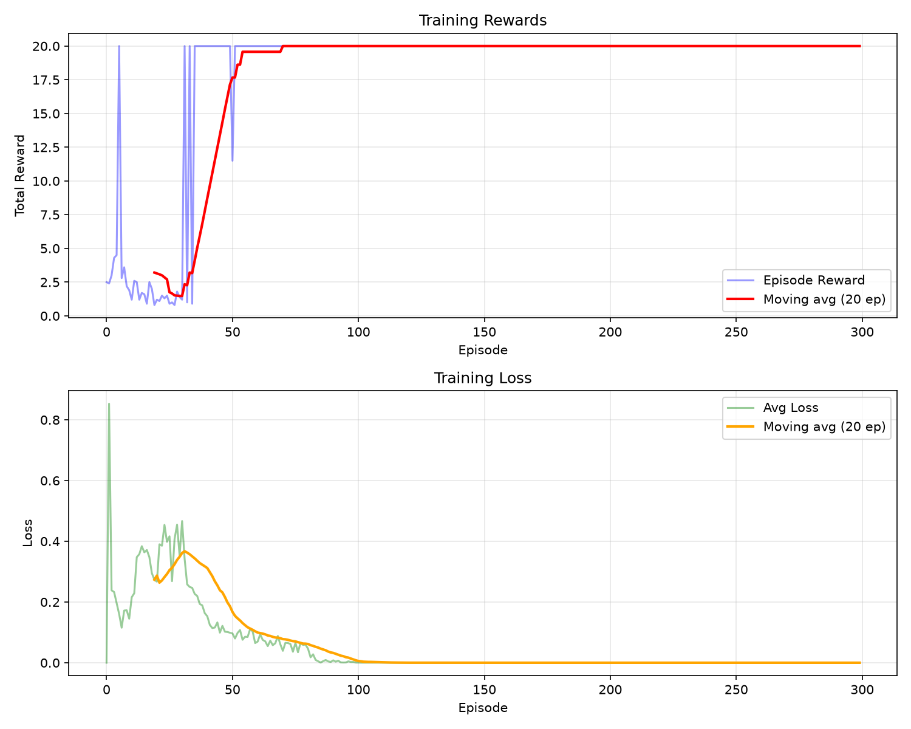
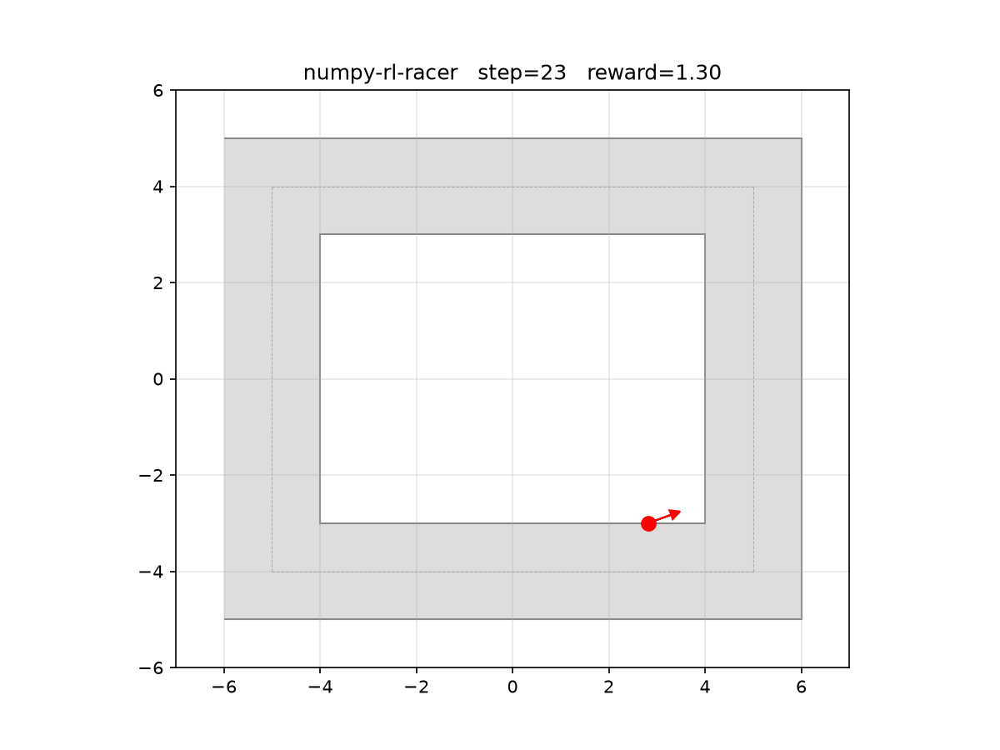

# NumPy RL Racer

A from-scratch Deep Reinforcement Learning project where a small autonomous car learns
to navigate a 2D environment with obstacles toward a goal position.

The goal is to implement the environment, neural networks, and RL algorithms using NumPy only.

## Project constraints

Runtime dependencies:
- numpy
- matplotlib

Forbidden ML/RL dependencies:
- torch
- tensorflow
- jax
- gymnasium
- stable-baselines3

## Roadmap

### ✅ Done

1. **Project skeleton** — Python package structure (`pyproject.toml`, `src/`, `tests/`).
2. **2D car physics** — `KinematicCar` / `CarState`: position, heading, velocity,
   steering, acceleration, speed limits, heading normalisation.
3. **Track representation** — `RectangularTrack` with a configurable road width and
   point-to-segment distance checking.
4. **Racing environment API** — `RacingEnv` with `reset(seed)` / `step(action)` returning
   `(obs, reward, done, info)`; episode ends when the car leaves the track.
5. **Visualization** — `MatplotlibRenderer`: top‑down plot of the track with the car
   position and heading arrow, step counter and reward overlay.
6. **NumPy neural network** — Feed‑forward network (Dense layers, ReLU,
   optional output activation) using only `numpy`, supporting forward‑pass,
   backward‑pass, and SGD optimisation.
7. **DQN from scratch** — Deep Q‑Network algorithm with experience replay,
   epsilon‑greedy action selection, target network, and Q‑learning loss —
   all implemented with NumPy-only gradient descent.
8. **Training and evaluation scripts** — `scripts/train.py` trains the DQN agent,
   logs episode rewards and losses, saves model parameters, and plots
   training curves. `scripts/evaluate.py` loads a trained model, renders
   evaluation rollouts, and saves screenshots.

## Training Results

The DQN agent was trained for 300 episodes on the default rectangular track. The
training curve below shows the episode reward and average loss.



After training, the greedy policy was evaluated for 3 episodes. Below are the
final frames of each evaluation rollout.

| Episode 1 | Episode 2 | Episode 3 |
|:---------:|:---------:|:---------:|
|  |  |  |

**Usage:**
```bash
# Train the DQN agent
uv run python scripts/train.py --episodes 300

# Evaluate a trained policy
uv run python scripts/evaluate.py --model-path models/best_model.npz
```

## Quickstart

```bash
# Install dependencies
uv sync

# Run tests
uv run pytest

# Lint with ruff
uv run ruff check .
```
