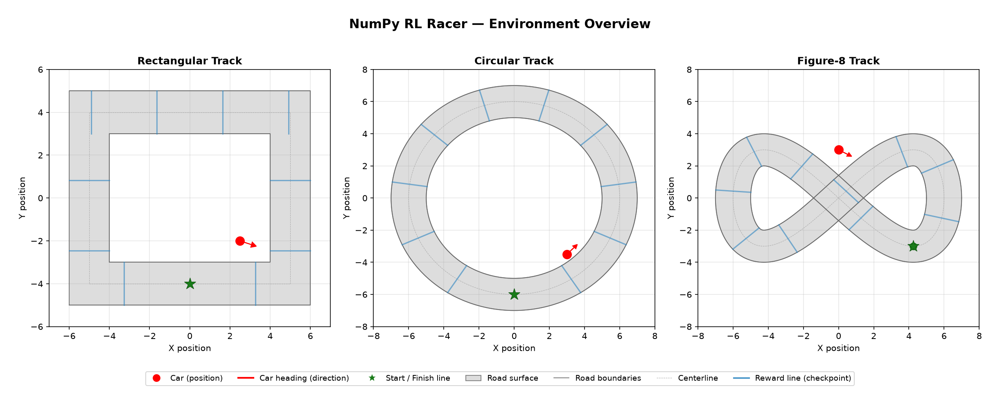

# NumPy RL Racer

A from-scratch reinforcement learning racing project where a **NumPy-only DQN**
agent learns to drive on procedurally generated 2D tracks.

No PyTorch, TensorFlow, JAX, Gymnasium, or external RL library.

## What It Does

The agent controls a small kinematic car on a generated closed-loop racetrack.
Each track is created from a seed, smoothed into a continuous road, and exposed
through local car-relative observations so the policy learns driving behavior
instead of memorising global coordinates.

The project intentionally keeps the learning stack simple:
- kinematic car physics;
- local observation vector with speed, heading error, distance to edge, and ray distances;
- progress-based reward with lap bonus and off-track penalty;
- plain DQN with replay buffer and target network;
- NumPy MLP, optimizers, schedulers, and checkpointing;
- Matplotlib rendering for still frames, GIFs, MP4 videos, and live evaluation.

## Visual Overview

Generate a gallery of procedural tracks:

```bash
uv run python scripts/preview_tracks.py --seeds 0 1 2 3 4 5 6 7
```

Default output:


The environment overview below shows multiple generated tracks with road
boundaries, centerlines, reward lines, and start/finish markers:



## Observation

The default training path uses a 9-dimensional local observation:

| Observation | Description |
|---|---|
| `speed_norm` | Forward speed normalized by max speed |
| `sin_heading_error`, `cos_heading_error` | Car heading relative to the local track tangent |
| `dist_to_edge` | Normalized distance to nearest road edge |
| `left_ray`, `front_left_ray`, `front_ray`, `front_right_ray`, `right_ray` | Local ray distances to road boundaries or obstacles |

## Actions

The environment exposes 5 discrete actions:

| Action | Steering | Acceleration |
|---|---:|---:|
| Steer left + accelerate | -1.5 | +1.0 |
| Steer right + accelerate | +1.5 | +1.0 |
| Go straight + accelerate | 0.0 | +1.0 |
| Coast | 0.0 | 0.0 |
| Brake | 0.0 | -0.5 |

By default, training uses the no-idle subset: steer left + accelerate, steer
right + accelerate, and go straight + accelerate.

## Quickstart

```bash
# Install dependencies
uv sync

# Run tests
uv run pytest

# Lint with ruff
uv run ruff check .
```

## Usage

```bash
# Preview generated tracks
uv run python scripts/preview_tracks.py --seeds 0 1 2 3 4 5 6 7

# Train the DQN agent on a procedural track
uv run python scripts/train.py \
  --episodes 500 \
  --max-steps 300 \
  --eval-freq 50 \
  --eval-episodes 3 \
  --save-dir models/local \
  --log-dir logs/local \
  --seed 0 \
  --track-seed 0

# Watch a trained agent live in a Matplotlib window
uv run python scripts/evaluate.py \
  --model-path models/best_model.npz \
  --live \
  --episodes 1 \
  --max-steps 400 \
  --fps 30

# Evaluate headlessly and save an MP4 video
uv run python scripts/evaluate.py \
  --model-path models/best_model.npz \
  --headless \
  --mp4 \
  --record-fps 30 \
  --save-dir images/tmp

# GIF export is still available when a lightweight animation is enough
uv run python scripts/evaluate.py \
  --model-path models/best_model.npz \
  --headless \
  --gif \
  --save-dir images/tmp

# Compare a trained policy against a random policy on the same generated track
uv run python scripts/compare_policies.py \
  --model-path models/best_model.npz \
  --save-dir images/tmp \
  --track-seed 0
```

## Procedural Tracks

`ProceduralTrack` creates a closed centerline from seeded control points, applies
Chaikin smoothing, then derives road boundaries and raycast segments. The same
seed always creates the same track, which keeps training and evaluation
reproducible while still making it easy to generate many layouts.

Useful controls:
- `--track-seed`: generated layout seed;
- `--track-radius`: base track size;
- `--track-points`: number of control points;
- `--track-variation`: radial shape variation;
- `--track-smoothing`: number of smoothing passes.

## Project Constraints

Runtime dependencies:
- numpy
- matplotlib
- pillow

Forbidden ML/RL dependencies:
- torch, tensorflow, jax, gymnasium, stable-baselines3

## Roadmap

Near term:
- Train over a pool of generated tracks instead of a single seed.
- Add evaluation on held-out track seeds.
- Record checkpoint-evolution videos to show the policy improving over training.
- Add summary plots for progress, off-track rate, and generalization.

Medium term:
- Improve ray sensor configuration.
- Add model cards for trained procedural-track checkpoints.
- Build a stronger visual README with training evolution and generalization videos.
